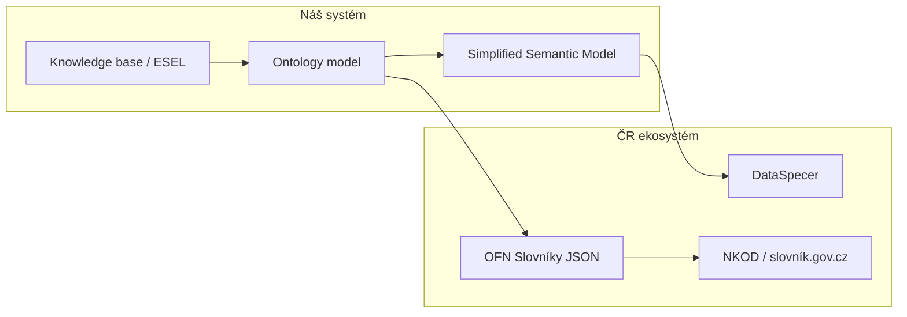

# OFN Slovníky – integrace, mapování a otázky pro DIA

Dokument popisuje, jak zapadá **OFN Slovníky** (verze `2026-02-26`) do projektu agentického asistenta pro sémantické modelování a integrace s **DataSpecerem**. Slouží jako podklad pro diskuzi s tvůrci normy (DIA) a jako interní rozhodovací dokument.

## 1. Účel

OFN Slovníky specifikuje **strukturu pro výměnu slovníků** popisujících data. Nejde o metodiku tvorby slovníků (ta je v [metodice popisu dat](https://data.gov.cz/popis-dat/)), ale o formát pro publikaci a konzumaci.

V našem use case:

1. Asistent iterativně navrhuje ontologii z právních dokumentů (ESEL, knowledge base).
2. Pracovní model ukládáme jako interní `Ontology` (třídy, atributy, vztahy).
3. Do **DataSpeceru** exportujeme přes **Simplified Semantic Model** (SSM).
4. Pro český ekosystém (DIA, NKOD, slovník.gov.cz) chceme navíc exportovat do **OFN Slovníky JSON** – pouze JSON část (JSON-LD s `@context`), bez Turtle/RDF.

---

## 2. Co z OFN potřebujeme

| Požadavek | Rozhodnutí |
|-----------|------------|
| Formát | JSON (JSON-LD s povinným `@context`) |
| Úroveň složitosti | **Konceptuální model** (Třída / Vztah / Vlastnost) |
| Rozšíření v1 | Mapování `Kind` → Typ subjektu/objektu práva |
| Rozšíření později | RPP anotace, § 23 vyhlášky 360/2023 Sb. |
| Směr konverze v1 | Ontology / SSM → OFN (export); import OFN → Ontology až později |
| Validace | JSON Schema 2020-12 z `ofn.gov.cz/slovníky/2026-02-26/` |

### Úrovně OFN (přehled)

1. **Slovník** – metadata slovníku (IRI, název, popis, časové razítka).
2. **Tezaurus** – pojmy bez modelových typů (hierarchie přes `nadřazený-pojem`).
3. **Konceptuální model** – pojmy jako Třída, Vztah, Vlastnost s `definiční-obor` / `obor-hodnot`.
4. **Rozšíření** – Typ subjektu/objektu práva, anotace RPP, § 23 vyhlášky 360/2023.

---

## 3. Mapování interního modelu na OFN

| Interní model (`Ontology`) | OFN Konceptuální model | Poznámka |
|---|---|---|
| `OntologyClass` | pojem typ `Třída` | + `Koncept`, `Pojem` |
| `OntologyRelationship` | pojem typ `Vztah` | `definiční-obor` + `obor-hodnot` |
| `OntologyAttribute` | pojem typ `Vlastnost` | `obor-hodnot` může být `xsd:*` |
| `generalizations` | `nadřazená-třída` | v tezauru: `nadřazený-pojem` |
| `Kind.SUBJECT` / `OBJECT` | `Typ subjektu práva` / `Typ objektu práva` | rozšíření § 1.4 |
| `definition_references` | `definující-ustanovení-právního-předpisu` | ELI IRI z ESEL |
| `specification_references` | `související-ustanovení-právního-předpisu`? | **nejasné – viz otázky** |
| `label` | `název.cs` | `en` volitelné |
| `definition` | `definice.cs` | formální definice |
| `description` | `popis.cs` | kontextový popis |

### Klíčové rozdíly oproti SSM

- OFN používá **české názvy vlastností s diakritikou** (`název`, `definiční-obor`).
- Povinný `@context`: `https://ofn.gov.cz/slovníky/2026-02-26/kompletní/kontext.jsonld`
- IRI konvence typicky `https://slovník.gov.cz/legislativní/sbírka/{zákon}/pojem/{název}`
- Všechny pojmy v jednom poli `pojmy[]`, ne oddělené `classes` / `attributes` / `relationships`
- Validace vůči více JSON Schema současně

