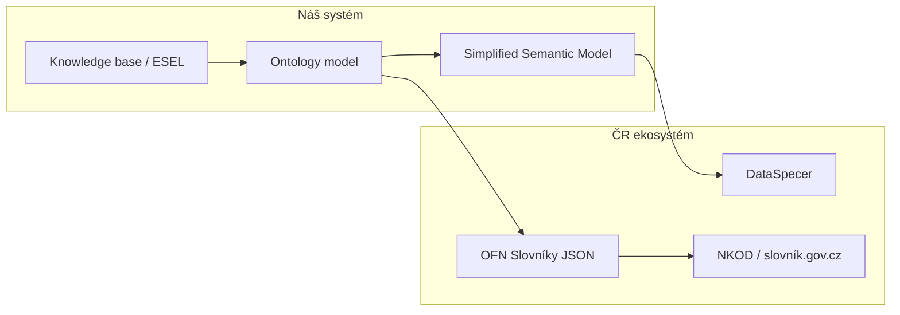

# OFN Slovníky – integrace, mapování a otázky pro DIA

Dokument popisuje, jak zapadá **OFN Slovníky** (verze `2026-02-26`) do projektu agentického asistenta pro sémantické modelování a integrace s **DataSpecerem**. Slouží jako podklad pro diskuzi s tvůrci normy (DIA) a jako interní rozhodovací dokument.

## 1. Účel

OFN Slovníky specifikuje **strukturu pro výměnu slovníků** popisujících data. Nejde o metodiku tvorby slovníků (ta je v [metodice popisu dat](https://data.gov.cz/popis-dat/)), ale o formát pro publikaci a konzumaci.

V našem use case:

1. Asistent iterativně navrhuje ontologii z právních dokumentů (ESEL, knowledge base).
2. Pracovní model ukládáme jako interní `Ontology` (třídy, atributy, vztahy).
3. Do **DataSpeceru** exportujeme přes **Simplified Semantic Model** (SSM).
4. Pro český ekosystém (DIA, NKOD, slovník.gov.cz) chceme navíc exportovat do **OFN Slovníky JSON** – pouze JSON část (JSON-LD s `@context`), bez Turtle/RDF.

---

## 2. Co z OFN potřebujeme

| Požadavek | Rozhodnutí |
|-----------|------------|
| Formát | JSON (JSON-LD s povinným `@context`) |
| Úroveň složitosti | **Konceptuální model** (Třída / Vztah / Vlastnost) |
| Rozšíření v1 | Mapování `Kind` → Typ subjektu/objektu práva |
| Rozšíření později | RPP anotace, § 23 vyhlášky 360/2023 Sb. |
| Směr konverze v1 | Ontology / SSM → OFN (export); import OFN → Ontology až později |
| Validace | JSON Schema 2020-12 z `ofn.gov.cz/slovníky/2026-02-26/` |

### Úrovně OFN (přehled)

1. **Slovník** – metadata slovníku (IRI, název, popis, časové razítka).
2. **Tezaurus** – pojmy bez modelových typů (hierarchie přes `nadřazený-pojem`).
3. **Konceptuální model** – pojmy jako Třída, Vztah, Vlastnost s `definiční-obor` / `obor-hodnot`.
4. **Rozšíření** – Typ subjektu/objektu práva, anotace RPP, § 23 vyhlášky 360/2023.

---

## 3. Mapování interního modelu na OFN

| Interní model (`Ontology`) | OFN Konceptuální model | Poznámka |
|---|---|---|
| `OntologyClass` | pojem typ `Třída` | + `Koncept`, `Pojem` |
| `OntologyRelationship` | pojem typ `Vztah` | `definiční-obor` + `obor-hodnot` |
| `OntologyAttribute` | pojem typ `Vlastnost` | `obor-hodnot` může být `xsd:*` |
| `generalizations` | `nadřazená-třída` | v tezauru: `nadřazený-pojem` |
| `Kind.SUBJECT` / `OBJECT` | `Typ subjektu práva` / `Typ objektu práva` | rozšíření § 1.4 |
| `definition_references` | `definující-ustanovení-právního-předpisu` | ELI IRI z ESEL |
| `specification_references` | `související-ustanovení-právního-předpisu`? | **nejasné – viz otázky** |
| `label` | `název.cs` | `en` volitelné |
| `definition` | `definice.cs` | formální definice |
| `description` | `popis.cs` | kontextový popis |

### Klíčové rozdíly oproti SSM

- OFN používá **české názvy vlastností s diakritikou** (`název`, `definiční-obor`).
- Povinný `@context`: `https://ofn.gov.cz/slovníky/2026-02-26/kompletní/kontext.jsonld`
- IRI konvence typicky `https://slovník.gov.cz/legislativní/sbírka/{zákon}/pojem/{název}`
- Všechny pojmy v jednom poli `pojmy[]`, ne oddělené `classes` / `attributes` / `relationships`
- Validace vůči více JSON Schema současně

---

## 4. Otázky pro tvůrce OFN (DIA)

Kontakty dle specifikace: Alice Binderová, Jakub Klímek, Petr Křemen, Martin Nečaský.

### Formát a validace

1. Je `@context` vždy povinný, i když spotřebujeme jen „plain JSON“ bez JSON-LD procesoru? Stačí konstanta, nebo musíme expandovat kontext?
2. Doporučujete validovat proti `kompletní/schéma.json`, nebo kombinaci jednotlivých schémat (`slovník` + `tezaurus` + `konceptuální-model` + rozšíření)?
3. Jak řešit verziování – pokud OFN vydá novou datumovou verzi, je zpětně kompatibilní migrace dokumentovaná?

### IRI a slovník.gov.cz

4. Jaká jsou přesná pravidla pro IRI legislativních slovníků (`/legislativní/sbírka/{číslo}/{rok}/pojem/...`)? Máme generovat IRI automaticky z názvu pojmu, nebo je přiděluje centrální registr?
5. Jak mapovat externí ontologie (např. `schema.org`) – jen přes `ekvivalentní-pojem`, nebo i jako `nadřazená-třída` mimo `slovník.gov.cz`?
6. Co dělat s pojmy bez schváleného IRI v rané fázi modelování (draft / working copy)?

### Mapování na metodiku popisu dat

7. Jaký je doporučený poměr `popis` vs `definice`? Náš asistent rozlišuje `description` a `definition` – kam co patří?
8. `definující-ustanovení` vs `související-ustanovení` – stačí ELI URL z ESEL, nebo je potřeba i vazba na konkrétní text odstavce v knowledge base?
9. Jak reprezentovat odkazy na ustanovení, která pojem specifikují, ale nedefinují (naše `specification_references`)?

### Konceptuální model

10. `obor-hodnot` pro atribut bez známého XSD typu – jaká je minimální požadavek? Můžeme použít `xsd:string` jako výchozí?
11. Podporuje OFN cardinality (1..1, 0..*) na vlastnostech/vztazích, nebo je to mimo rozsah výměnného formátu?
12. `nadřazený-vztah` – jak se má chovat při více nadřazených vztazích z generických slovníků?

### Rozšíření pro DIA

13. Pro legislativní slovníky: stačí `Typ subjektu/objektu práva`, nebo je RPP anotace povinná při publikaci do NKOD?
14. Kdy je povinné rozšíření § 23 vyhlášky 360/2023 Sb. (`způsob-získání-údaje`, `typ-obsahu-údaje`) – jen u pojmů označených jako údaje v ISVS?
15. Existuje referenční mapping mezi OFN Slovníky JSON a DSV / DataSpecer simplified model, nebo jsou to nezávislé výstupy?

### Integrace s DataSpecerem

16. Doporučujete OFN JSON jako vstup do DataSpeceru, nebo OWL/Turtle jako primární a OFN jen na publikaci?
17. Plánuje DIA oficiální adaptér OFN ↔ RDF v rámci DataSpecer ekosystému?

### Publikační workflow

18. Jaký je očekávaný výstup pro registraci do NKOD – jeden JSON soubor, nebo balík (JSON + metadata z § 12)?
19. Existují referenční implementace konvertorů (open source) kromě ukázek v dokumentaci?

---

## 5. Otevřená rozhodnutí v našem projektu

| Téma | Rozhodnutí v1 |
|------|----------------|
| Cílová úroveň OFN | Konceptuální model; Tezaurus jako fallback pokud chybí domény/range |
| Rozšíření | `Kind` → Typ subjektu/objektu práva; RPP a §23 až v další fázi |
| Jazyk metadat | `název.cs` povinné; `en` doplníme pokud existuje |
| IRI strategie | Konfigurovatelný base IRI v konvertoru (default `slovník.gov.cz/legislativní/sbírka/{id}`) |
| XSD range bez hodnoty | Default `xsd:string` (do potvrzení od DIA) |
| specification_references | Mapovat na `související-ustanovení-právního-předpisu` (do potvrzení) |

---

## 6. Fáze integrace

### Fáze 1 – experimentální konvertor (hotovo v repozitáři)

Samostatný balíček [`ofn-converter/`](../ofn-converter/):

- `Ontology` JSON nebo SSM JSON → OFN Slovníky JSON
- Validace proti staženým JSON Schema
- CLI: `python convert.py --from ontology --input ... --validate`

### Fáze 2 – ověření s DIA

- Projít otázky v § 4 s tvůrci OFN
- Upravit mapování dle odpovědí
- Otestovat na reálném slovníku (zákon 56/2001 Sb.)

### Fáze 3 – integrace do backendu

- Modul `ontology/ofn_export.py` v agentickém backendu
- Export z CLI / API analogicky k DataSpecer exportu v `design_project_tool.py`

---

## 7. Rizika a omezení v1

- **Chybějící XSD range** na atributech – používáme `xsd:string` jako default
- **Externí nadřazené třídy** mimo náš slovník – exportujeme IRI, definice nemusí být v `pojmy[]`
- **Schémata OFN** – cachujeme lokálně v `ofn-converter/schemas/` (ofn.gov.cz může vracet 403 z některých prostředí)
- **Obousměrný import** (OFN → Ontology) není v1 – pouze export pro vyzkoušení formátu
