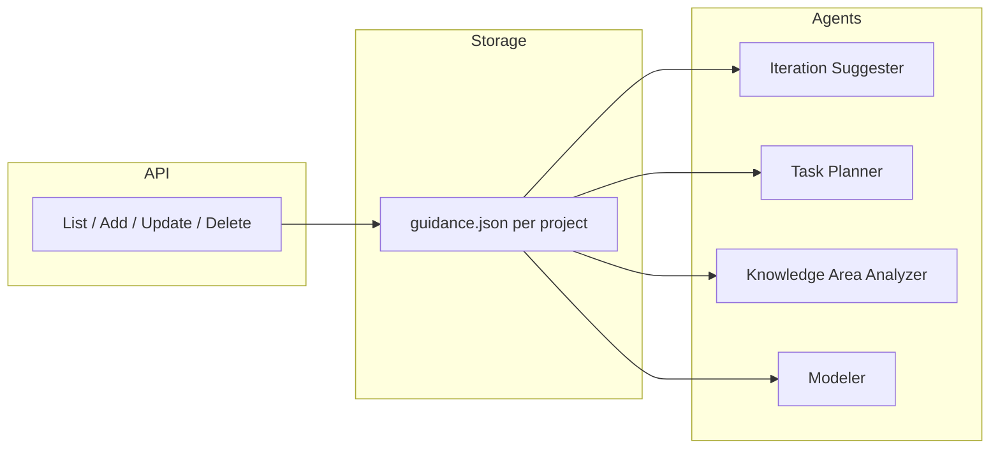

# Human-in-the-loop: projektové inštrukcie a spätná väzba

Postupná dokumentácia toho, ako som pristúpil k HITL v semantic-modeling-assistant — moje rozhodnutia, čo som implementoval, aké iné prístupy som zvažoval a kde by som mal pokračovať.

---

## 1. Kontext: dva prístupy k HITL

Potreboval som si ujasniť, čo vlastne chcem od „human-in-the-loop“. Rozdelil som to na dve veci:

**A) HITL pri vykonávaní akcií (approve / edit / reject)**  
Agent navrhne akciu, zastaví sa a čaká na moje rozhodnutie. V praxi to znamená checkpointing, thread_id, možnosť neskôr pokračovať. Toto som zatiaľ nechal bokom — prišlo mi rozumnejšie najprv mať trvalé pravidlá, ktorými sa agent riadi, a až potom pridať „zastavenie pred akciou“.

**B) Trvalá projektová inštrukcia / preferencie**  
Chcel som, aby som mohol k projektu pridať zoznam inštrukcií, ktoré tam ostávajú a agent sa podľa nich riadi pri každom volaní. Keď niečo z tohto zoznamu odstránim, agent sa tým už neriadi. Backend mal len jednorazový `user_instruction` v requestoch — to mi nestačilo. Implementoval som teda perzistentnú zbierku viazanú na projekt s CRUD a automatickým vkladaním do kontextu.

---

## 2. Z čoho zbierať dáta — moja úvaha a čo som zatiaľ zvolil

Uvažoval som nad tým, **z akých situácií** by som chcel brať text, ktorý sa stane projektovou inštrukciou:

- Keď **sám napíšem** pravidlo alebo smernicu (napr. jazyk, štýl).
- Keď **opravím** výstup agenta alebo **odmietnem** návrh — aby sa táto korekcia „zapamätala“ pre daný projekt.
- Keď mám **preferencie** (pomenovanie, konvencie) alebo naopak **zákazy** (čo agent nemá robiť).
- Prípadne keď v jednom requeste pošlem `user_instruction` a **chcem ju uložiť** medzi trvalé inštrukcie („pridať do zoznamu“).

Aby som to mal v dátach prehľadné a v UI filtrovateľné, zvolil som **typy** položiek: `instruction`, `correction`, `preference`, `constraint`.

| Typ | Hodnota | Význam |
|-----|---------|--------|
| instruction | `"instruction"` | Všeobecná projektová pravidlá / smernica (napr. jazyk, štýl). |
| correction | `"correction"` | Korekcia po chybe alebo odmietnutí návrhu – čo sa má „zapamätať“ pre projekt. |
| preference | `"preference"` | Preferencie, konvencie (pomenovanie, štýl popisov). |
| constraint | `"constraint"` | Zákazy / obmedzenia – čo agent nemá robiť. |

Každá položka má `content` (voľný text) a voliteľne `source` (`manual`, `correction`, `saved_from_request`) — source som zatiaľ v API neprebíjal, je v doméne pripravené na neskoršie použitie (napr. keď budem chcieť z jedného kliku uložiť aktuálnu `user_instruction` ako novú položku).

**Iné pohľady / možnosti, ktoré som zvažoval:**

- **Žiadne typy** — len jeden zoznam voľného textu. Jednoduchšie, ale horšie pre prehľad a neskoršie filtre („ukáž len korekcie“).
- **Jemnejšia typológia** — napr. viazanie položky na konkrétnu odmietnutú operáciu alebo na oblasť ontológie. Zatiaľ som to nechal na „voľný text + typ“, aby som nekomplikoval prvú verziu.
- **Priorita / poradie** — či niektoré inštrukcie majú mať vyššiu váhu alebo sa v prompte zobrazovať skôr. Zatiaľ nie; všetky idú do jedného bloku v poradí v zozname.

**TODO / kde pokračovať:**

- [ ] V UI alebo API umožniť „uložiť aktuálnu user_instruction ako novú guidance položku“ (využiť `source: saved_from_request`).
- [ ] Pri odmietnutí návrhu (napr. operácie) ponúknuť „pridať dôvod odmietnutia medzi projektové inštrukcie“ (korekcia).
- [ ] Zvážiť prioritu alebo kategóriu (oblast ontológie), ak bude položiek veľa a kontext sa bude musieť orezávať.

---

## 3. Ukladanie — princíp a rozhodnutie

Chcel som, aby dáta boli **špecifické pre jeden projekt** a aby sa dali ľahko zálohovať spolu s projektom. Zvažoval som:

- **Rozšíriť `project.json`** o pole s guidance položkami. Nevýhoda: pri každej úprave inštrukcie by sa musel zapisovať celý ťažký projekt; zápisy častejšie.
- **Samostatný súbor** v priečinku projektu, napr. `guidance.json`. Výhoda: mením len guidance, projekt sa netreba dotýkať; záloha projektu = priečinok = mám tam aj guidance.

Rozhodol som sa pre **samostatný súbor** `data/projects/{project_id}/guidance.json`. Model položky: `id`, `project_id`, `type`, `content`, `created_at`, `source` (voliteľné). Implementácia: doména v `design_project/domain.py`, úložisko v `design_project/project_guidance_store.py` (FileSystemProjectGuidanceStore).

**TODO:**

- [ ] Ak budem mazať projekt, zvážiť mazanie celého priečinka (vrátane `guidance.json`).

---

## 4. Ako to posielam agentovi — servis a integrácia

Chcel som, aby agent **vždy** dostal najprv projektové inštrukcie a potom (ak je) jednorazovú `user_instruction` z requestu. Preto som:

- Zavedol **ProjectGuidanceService** s CRUD a metódou **get_guidance_text_for_prompt(project_id)**, ktorá vráti jeden blok v tvare `<PROJECT_GUIDANCE> ... </PROJECT_GUIDANCE>`. Nastavil som voliteľný limit znakov (8000), aby som nepreplnil kontext.
- V **DesignProjectService** som pridal voliteľný `guidance_service` a pomocnú metódu **_effective_user_instruction(project_id, user_instruction)** — tá vráti najprv guidance blok, potom user_instruction. Túto „efektívnu“ inštrukciu som začal predávať všade, kde sa volajú agenti: iteration suggester, task planner, knowledge domain area analyzer, a pri voľnej inštrukcii modelera.
- Pri **modelerovi** a generovaní operácií z úloh (`get_operations_for_design_task`) som nemal priamo `user_instruction`; kontext sa skladá z úlohy. Preto som do modelera pridal voliteľný parameter **project_guidance_text** a v `_get_context()` ho vkladám na začiatok. V `prepare_planned_iteration` sa guidance načíta raz a predáva sa do každého volania `get_operations_for_design_task`.

Súčasné API som zachoval: `user_instruction` v requestoch ostáva jednorazová; projektové položky sa vždy načítajú zo súboru a zlúčia sa s ňou.

**Iný pohľad:** Mohol by som guidance posielať len do niektorých agentov (napr. len do modelera). Zatiaľ chcem konzistentné správanie — všetci agenti, ktorí dostávajú „inštrukciu“, dostanú aj projektové pravidlá.

**TODO:**

- [ ] Sledovať, či 8000 znakov stačí alebo či treba relevance filtrovanie (napr. podľa typu úlohy), keď položiek pribudne.

---

## 5. Vypisovanie, úprava, zmazanie — API

Potreboval som vedieť zoznam položiek zobraziť, pridať novú, upraviť alebo zmazať — a aby po zmazaní/úprave sa agent ďalším volaním už riadil novým stavom. Implementoval som REST CRUD:

- **GET** `/api/projects/{project_id}/guidance` — zoznam položiek.
- **POST** `/api/projects/{project_id}/guidance` — pridanie (body: `content`, `type`).
- **PATCH** `/api/projects/{project_id}/guidance/{item_id}` — úprava `content` alebo `type`.
- **DELETE** `/api/projects/{project_id}/guidance/{item_id}` — zmazanie; agent sa touto položkou už neriadi.

Guidance sa nekešuje — pri každom volaní agenta sa znova načíta zo súboru, takže zmeny sú okamžite účinné.

**TODO:**

- [ ] Frontend: sekcia „Projektové inštrukcie“ / „Human-in-the-loop“ — zoznam, formulár na pridanie, úprava, zmazanie.

---

## 6. Prehľad a ďalšie kroky

**Prehľad toku:**

```
  API (List / Add / Update / Delete)  ──►  guidance.json (úložisko)
                                                      │
                                                      ▼
   Agenti: Iteration Suggester, Task Planner, Knowledge Area Analyzer, Modeler
```

*(Ak máš Mermaid podporu, môžeš použiť zdroj nižšie; inak vyššie je textová schéma.)*

<details>
<summary>Mermaid zdroj (flowchart)</summary>



</details>

Úložisko je projektovo špecifické, API umožňuje plný CRUD, agenti dostávajú zlúčený blok guidance + user_instruction. Tým mám hotovú vrstvu **B)** (trvalé projektové inštrukcie).

**Kde pokračovať — môj zoznam:**

1. **Frontend** pre guidance (zoznam, pridanie, úprava, zmazanie).
2. **Uloženie user_instruction ako položka** (jedným klikom / volaním) a prípadne **„pridať korekciu“** pri odmietnutí návrhu.
3. **HITL typu A** — schvaľovanie konkrétnych akcií (napr. pred aplikovaním operácií): interrupt, uloženie stavu, endpoint na „resume s rozhodnutím“ (approve/edit/reject). Úložisko a API pre guidance môžu ostať ako sú.
4. **Priorita / relevance** guidance, ak bude položiek veľa a kontext treba obmedziť.

---

## Súhrn — čo som urobil a čo ostáva

| Téma                    | Čo som urobil                                                                                                                                       | Čo ostáva / TODO                                                                          |
| ----------------------- | --------------------------------------------------------------------------------------------------------------------------------------------------- | ----------------------------------------------------------------------------------------- |
| **Zdroje / typy**       | Zvolil som typy instruction, correction, preference, constraint a source v doméne; zatiaľ len manuálne pridávanie cez API.                              | Uloženie user_instruction ako položka; „pridať korekciu“ pri odmietnutí; zvážiť prioritu. |
| **Ukladanie**           | Samostatný súbor `guidance.json` v priečinku projektu, FileSystemProjectGuidanceStore.                                                               | Mazanie guidance pri mazaní projektu (ak chýba).                                          |
| **Posielanie agentovi** | get_guidance_text_for_prompt(), _effective_user_instruction(), vkladanie do všetkých relevantných agentov vrátane modelera (project_guidance_text). | Sledovať limit kontextu; prípadne relevance filtrovanie.                                  |
| **API**                 | GET/POST/PATCH/DELETE pre guidance; kontrola projektu, 404 pre chýbajúcu položku.                                                                    | Frontend pre zobrazenie a správu.                                                         |

Tým mám dobrý štart pre projektovo špecifický human-in-the-loop; ďalší krok je u mňa frontend a potom buď uľahčenie „uložiť ako inštrukciu“ / korekcie, alebo HITL typu A (schvaľovanie akcií).
